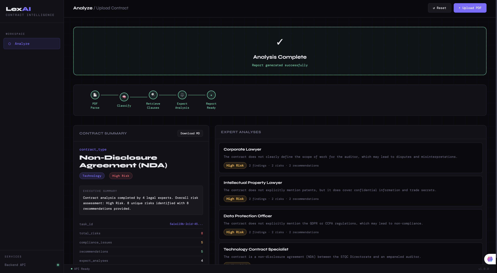
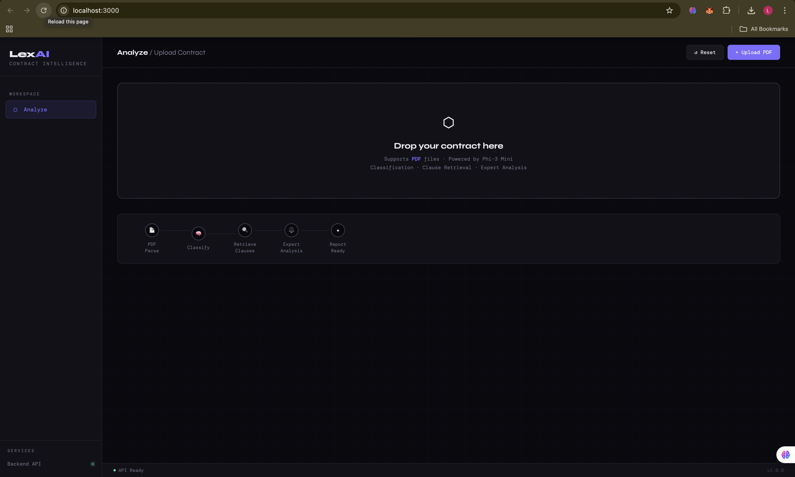

# LexAI - AI-Powered Legal Contract Analyzer

An intelligent system for automated legal contract analysis using LLMs, vector databases, and multi-agent expert review.

## 📸 Demo

### Video Walkthrough

*Full workflow demonstration - Upload, Analysis, and Results*

### Screenshots

<details>
<summary>Click to view screenshots</summary>

#### Upload Interface

*Clean drag-and-drop interface for PDF uploads*

#### Real-time Processing

*Live progress tracking through 5 analysis stages*

#### Analysis Results

*Contract summary with expert analyses*

#### Detailed Analysis

*In-depth findings, risks, and recommendations*

</details>

---

## 🌟 Features

- **Automated Contract Classification** - Identifies contract type and industry using Phi-3 Mini
- **Multi-Expert Analysis** - 4 specialized legal experts analyze contracts in parallel
- **Clause Retrieval** - Semantic search for relevant clauses using Qdrant vector database
- **Risk Assessment** - Comprehensive risk identification and compliance checking
- **Modern Web UI** - Clean, dark-themed interface with real-time progress tracking
- **Markdown Reports** - Downloadable detailed analysis reports

## 🏗️ Architecture

```
┌─────────────┐      ┌──────────────┐      ┌─────────────┐
│   Frontend  │─────▶│  FastAPI     │─────▶│  LangGraph  │
│  (Vanilla)  │      │   Backend    │      │   Workflow  │
└─────────────┘      └──────────────┘      └─────────────┘
                            │                      │
                            ▼                      ▼
                     ┌──────────────┐      ┌─────────────┐
                     │   Qdrant     │      │  Phi-3 Mini │
                     │   Vector DB  │      │   (Ollama)  │
                     └──────────────┘      └─────────────┘
```

## 📋 Prerequisites

- Python 3.11+
- Ollama with Phi-3 Mini model
- Qdrant vector database
- Modern web browser

## 🚀 Quick Start

### 1. Clone Repository

```bash
git clone <your-repo-url>
cd AI-Tool-to-Read-and-Analyze-Legal-Contracts-Automatically_Infosys_Internship_Jan26
```

### 2. Setup Backend

```bash
cd contract-classifier

# Create virtual environment
python -m venv venv
source venv/bin/activate  # On Windows: venv\Scripts\activate

# Install dependencies
pip install -r requirements.txt

# Configure environment
cp .env.example .env
# Edit .env with your settings

# Start Qdrant (Docker)
docker run -p 6333:6333 qdrant/qdrant

# Ingest clause database
python ingestion.py

# Start API server
python api.py
```

### 3. Setup Frontend

```bash
cd ../frontend

# Start web server
python -m http.server 3000
```

### 4. Access Application

Open browser to: `http://localhost:3000`

## 📁 Project Structure

```
├── contract-classifier/          # Backend API
│   ├── api.py                   # FastAPI server with CORS
│   ├── graph/                   # LangGraph workflow
│   │   └── classification_graph.py
│   ├── parser/                  # PDF parsing
│   │   └── document_parser.py
│   ├── prompts/                 # LLM prompts
│   ├── retrieval.py             # Qdrant integration
│   ├── ingestion.py             # Clause database setup
│   ├── uploads/                 # Temporary file storage
│   └── results/                 # Generated reports
│
├── frontend/                    # Web interface
│   ├── index.html              # Main page
│   ├── styles.css              # Dark theme styling
│   ├── app.js                  # API integration
│   └── README.md               # Frontend docs
│
├── .gitignore
├── LICENSE
└── README.md
```

## 🔧 Configuration

### Backend (.env)

```env
OLLAMA_BASE_URL=http://localhost:11434
QDRANT_URL=http://localhost:6333
MODEL_NAME=phi3:mini
```

### Frontend (app.js)

```javascript
const API_BASE = 'http://localhost:8000';
```

## 📊 API Endpoints

- `POST /analyze` - Upload and analyze contract
- `GET /result/{task_id}` - Get analysis results
- `GET /download/{task_id}` - Download markdown report
- `GET /health` - Health check

## 🎯 Usage

1. **Upload Contract** - Drag & drop or click to upload PDF
2. **Watch Progress** - Real-time pipeline visualization (5 steps)
3. **View Results** - Contract summary and expert analyses
4. **Explore Details** - Click any analysis for detailed findings
5. **Download Report** - Get comprehensive markdown report

## 🧪 Testing

```bash
cd contract-classifier
python test_api.py
```

## 🛠️ Tech Stack

**Backend:**
- FastAPI - Modern Python web framework
- LangGraph - LLM workflow orchestration
- Qdrant - Vector database for semantic search
- Ollama - Local LLM inference (Phi-3 Mini)
- PyPDF2 - PDF text extraction

**Frontend:**
- Vanilla JavaScript - No framework overhead
- CSS3 - Modern dark theme with animations
- Fetch API - RESTful communication

## 📝 License

MIT License - See LICENSE file

## 👥 Contributors

Infosys Internship Project - January 2026

## 🙏 Acknowledgments

- Phi-3 Mini by Microsoft
- Qdrant vector database
- LangChain/LangGraph framework
